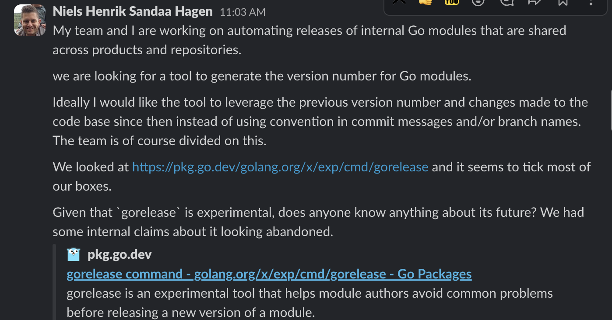
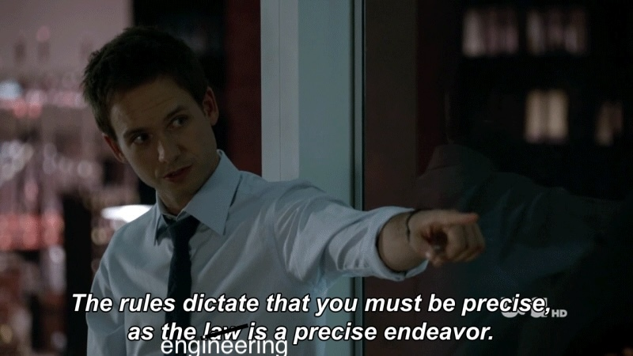
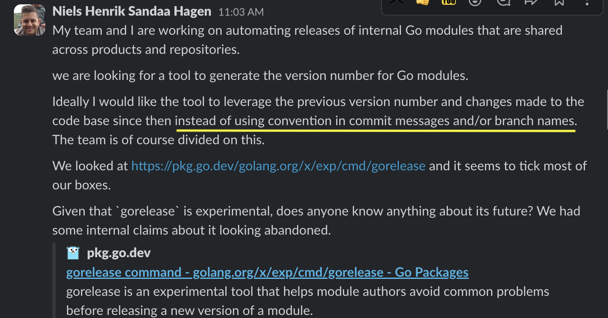
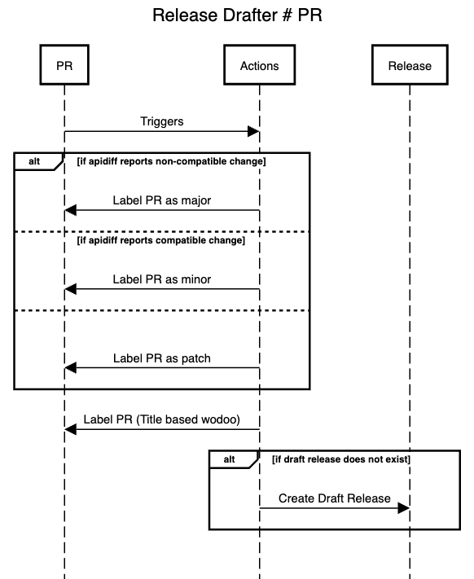
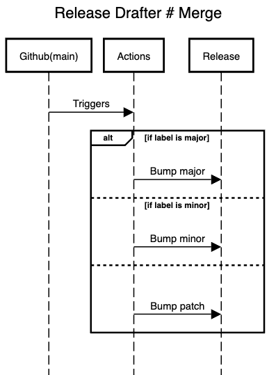

# Release Drafter

---
<!-- backgroundColor: #232529 -->

---

## Full discussion on the issue

https://github.com/coopnorge/engineering-issues/issues/325

---

## Available Option

- Release Drafter (https://github.com/release-drafter/release-drafter, we didn't want to use commit message and/or branch names)
- Gorelease (Looked abandoned, but still works) (https://github.com/golang/go/issues/26420)
- Apidiff (https://pkg.go.dev/golang.org/x/exp/apidiff)

---
<!-- backgroundColor: #232529 -->

---
<!-- backgroundColor: #232529 -->

---

### So, the solution was to use PR title and body 😉

https://github.com/release-drafter/release-drafter

---

# Kinda

---

#
<!-- backgroundColor: white -->

---

#
<!-- backgroundColor: white -->

---
<!-- backgroundColor: #232529 -->

# Demo

---
<!-- backgroundColor: #232529 -->

# Further Improvements?

- Read the PR body and extract additional labels
- What does the team need?

---
<!-- backgroundColor: #232529 -->

# Thank you